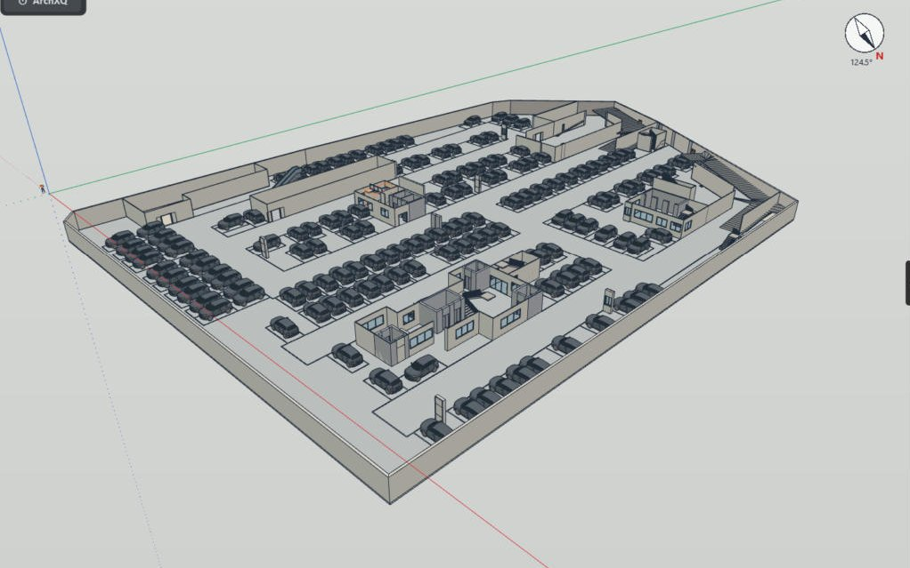

# CAD2IngeTrazo

**CAD floor plans (DWG / DXF) to an editable BIM model in [IngeTrazo](https://github.com/ingelibre/ingetrazo), level by level.**

CAD2IngeTrazo reads your AutoCAD plans by their layers and builds the building in IngeTrazo. It makes walls, doors, windows, curtain walls, columns, beams, slabs, lift cores, stairs with railings, car ramps, parking with cars, rooms with floor finishes, terraces, balconies, the plot with setbacks, a boundary wall and excavations. Floors stack at their true heights. Every element belongs to a named component type (D-01, W-03, C-02…) that you can select, edit or replace as a whole. Plans, elevations, sections and sheets come from the model, and you can export PDF, DXF and SketchUp.

- **Version:** 3.11 · tested with IngeTrazo 0.5.7 (Windows)
- **Licence:** GPL-3.0-or-later
- **📖 User manual:** [docs/MANUAL.md](docs/MANUAL.md)
- **Plugin guide (IngeTrazo):** [docs/plugins.md](https://github.com/ingelibre/ingetrazo/blob/main/docs/plugins.md)
- **Extensions catalogue:** [ingetrazo-extensions](https://github.com/ingelibre/ingetrazo-extensions#english)

## Install

1. Download `cad2ingetrazo-v3.11.zip` from the [latest release](../../releases/latest).
2. Close IngeTrazo. Extract the zip into `%APPDATA%\ingetrazo\plugins\`. You should end up with `%APPDATA%\ingetrazo\plugins\cad2ingetrazo\`.
3. Start IngeTrazo. The **CAD2IngeTrazo** panel opens on the right, and a CAD2IngeTrazo toolbar is added.

Python packages used: `ezdxf` and `shapely` — both ship with the IngeTrazo Windows build (0.5.7).

## Quick start

1. **1 Import CAD plan** ▸ **…** pick the DWG or DXF, and check the floor height.
2. If the file holds several plans: **Select floor on drawing…**. Drag a box round the plan, then click a reference point (a grid intersection).
3. Click **Import to «Level 1»**. Add more floors with **＋ Level (new, above)** or **＋ Basement (new, below)**.
4. **7 ▸ Stairs on all floors**, **Terraces over the floors below**.
5. Right-click any element to edit it, or edit a whole type in **12 Components**.
6. When the CAD changes: **Update from CAD (all levels)**.

The full walkthrough is in the [user manual](docs/MANUAL.md).

## What's new in 3.11

- **CAD lines:** a toggle on the panel and on the toolbar shows or hides the CAD linework in plan views.
- **Stairs:** landings line up flush with the flights.
- **Stair railings:** sides inner, outer, both or none; inset, baluster spacing and run-on are adjustable.
- **Columns:** better detection, including shear walls, L/T/C sections and layers named for a range of floors.
- **Lift cores:** detects lift banks drawn as one U of wall, and lift wells marked only by a «LIFT» text.
- **Walls:** **Edit part of this wall…** to change one stretch of a wall.
- **Car ramps:** fit the plan lines (stripes, not chevrons; slanted ends).
- **Excavation and fill** under **4 Plot (site)**, ArchXQ-style. Set the bottom, the side slope and get volumes.
- **Library components:** replace any component type with an IngeTrazo library component.

## Notes for reviewers

- **DWG reading:** DWG files are converted to DXF before reading. When IngeTrazo's own converter (LibreDWG) cannot read a DWG, `cadread.py` runs a converter already installed on the user's PC, in this order:
  1. AutoCAD's `accoreconsole.exe`, running `DXFOUT`
  2. the ODA File Converter

  Both run with `subprocess`, with no window and no network. The converted DXF is cached in `%LOCALAPPDATA%\ingetrazo\c2i_dxf`.
- **No network access.** Errors are written to `%APPDATA%\ingetrazo\plugins\cad2ingetrazo_errors.log`.
- **Plugin data** is stored inside the IngeTrazo document (`scene.plugin_data["cad2ingetrazo"]`).

## Credits

The modelling engine (`engine/`: walls, structure, plot geometry, model format) comes from **ArchXQ IT Lite** © Orlando Souza / XQ (GPL-3.0-or-later). CAD2IngeTrazo and its CAD import are by M. Tariq. Licensed under the GNU General Public License v3.0 or later; see [LICENSE](LICENSE).
